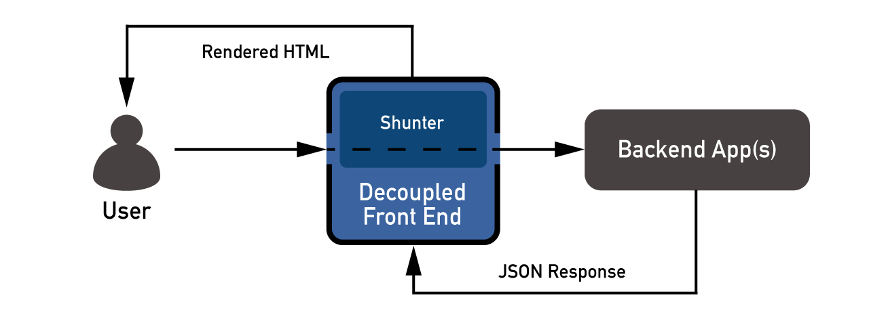

Introduction to Shunter
=======================

Looking to create a smart, flexible, robust, loosely-coupled front end?

Need a hand defining integration points between your front and back end applications?

Want to use the same unified front end across both your rails(/PHP/ASP/other) application, and your Wordpress-driven blog?

Shunter is for you.

Technically speaking Shunter runs your loosely-coupled front end as a node.js server, acting as a reverse proxy in front of your back end application(s).  This can be deployed on the same or a different server from your other applications as you see fit (it's super lightweight).

When a request comes in from a user, it's proxied through to your back end application (or can use multiple back ends using some simple [routing logic](usage/routing.md)).  Any JSON response which is sent back with the special `Content-Type` `application/x-shunter+json` will be taken by Shunter and [transformed using Dust.js](usage/templates.md), while any other resource is transparently passed back through to the user.

---

Next steps:

- [Getting Started](getting-started.md)
